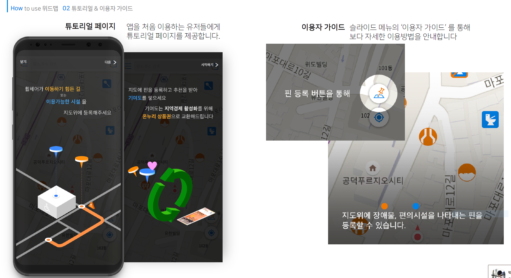
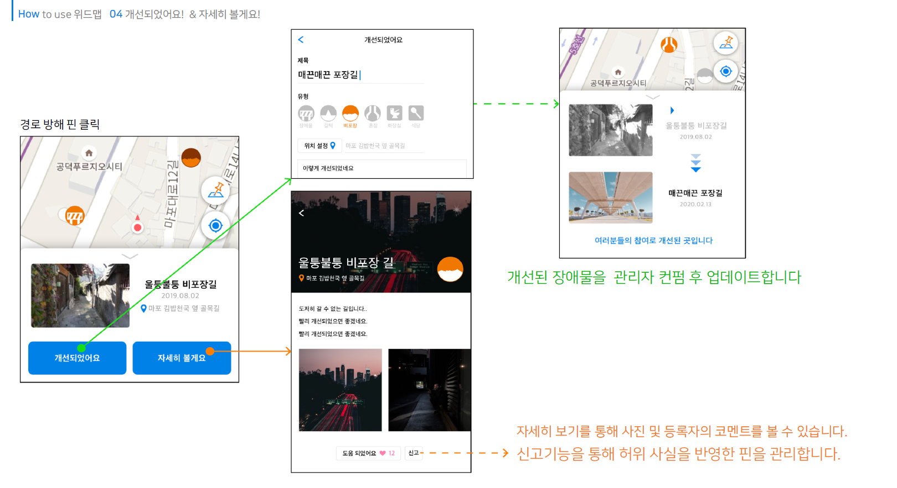
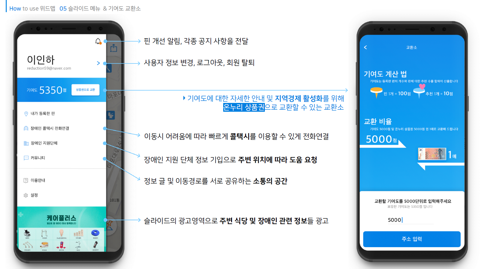

# WithMap-Android

  모두가 자유로운 서울로, 다 함께 만드는 보행약자를 위한 지도 *WITH MAP*

- **개발 기간 : 19.09.07 ~ 19.09.30  ( 3주 )**

## Develop Environment

- Complier - **Android Studio**
- Language - **Kotlin**
- Compile SDK Version - **28**
- Optimized Device -**Galaxy s8+**
- Mininum SDK Version - **16**

## Dependencies

| Name                    | URL                                              |
| ----------------------- | ------------------------------------------------ |
|                   |                    |

## WorkFlow

## Collaborator

- **윤혁** - [Malibin](https://github.com/nightmare73)

- **홍지원** - [vitriol2](https://github.com/vitriol2)

[Contributor List](https://github.com/WithMap/WithMap-Android/graphs/contributors)
